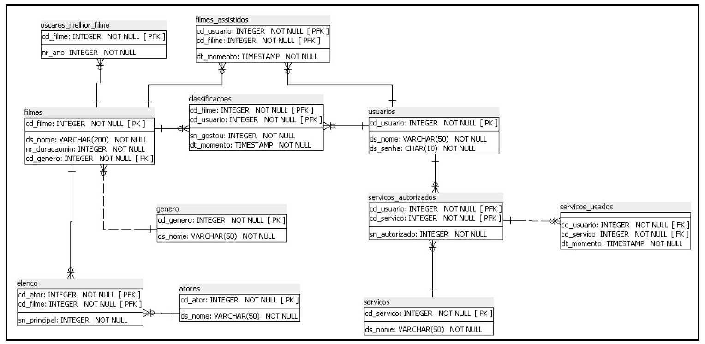

# trabalho_a4
 trabalho a4 da materia Engenharia de Software Orientada a Serviço
  
Objetivo:
- criar serviço web usando Jersey  
  
Banco de dados:

Funcionalidades:
1. Serviço para se autenticar na aplicação
2. Serviço para retornar uma lista dos filmes que contém em seu nome uma string informada
3. Serviço (incluir, alterar e excluir) para classificar um filme como gostou ou não gostou informando o código do filme
4. Serviço para retornar uma lista dos filmes que tiveram oscares
5. Serviço para retornar que vai começar a assitir um filme, informando seu código
6. Serviço para informar que vai começar a assitir um filme, informando seu código
7. Registrar os serviços usando os itens (03 - incluir, 03 - alterar, 03 - excluir, 06)
  
URI | Método | Formato | Efeito|
---|----|---|---\
/cliente/listar | GET | Coleção de Clientes | Busca a lista de Clientes cadastrados|
/cliente/{id} | GET | Cliente| Busca um Cliente|
/cliente/{id} | DELETE| - | Remove um Cliente|
/cliente | POST | Cliente | Inclui um cliente|
/cliente | PUT | Cliente | Altera um cliente|